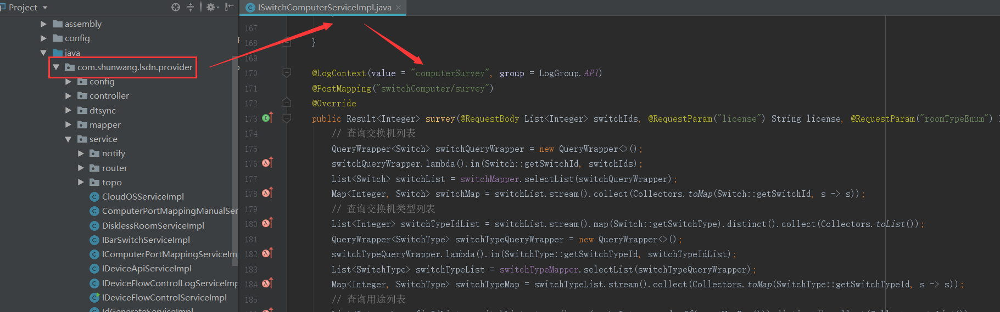

# 1. LSDN #

## 1.1 代码地址 ##
[https://svn.shunwang.com/svn/icloud/Code/Code_A/APPSTORE/SW_CLOUD_WEB/cloud-lsdn/trunk](https://svn.shunwang.com/svn/icloud/Code/Code_A/APPSTORE/SW_CLOUD_WEB/cloud-lsdn/trunk)

## 1.2 架构##

## 1.3 重要业务流程 ##

**1.3.1 端口自动映射**

1.3.1.1 端口自动映射触入口

- 定时任务
<pre>
任务调度中心
http://cpcxxl.icloud.cn/
</pre>

- 网络管理-线路管理-立即映射
<pre>
云计算后台管理系统
https://manager.icloud.cn/network/router/line
</pre>

- 主机详情-网络配置-立即映射
<pre>
云计算后台管理系统
https://manager.icloud.cn/cpc/host/hostList
如果主机有丢失映射的话，后面会出现立即映射的按钮
</pre>

1.3.1.2 端口自动映射接口

1.3.1.3 端口自动映射流程

**1.3.2 主机探测**

1.3.2.1 主机探测入口

- 接入交换机管理-主机探测
<pre>
云计算后台管理系统
https://manager.icloud.cn/network/switch/probe
</pre> 

1.3.2.2 主机探测接口

1.3.2.3 主机探测流程****

**1.3.3 划vlan**

1.3.3.1 划vlan入口

- 网吧调度划vlan
- 互联网调度划vlan

1.3.3.2 划vlan接口

1.3.3.3  划vlan流程****

